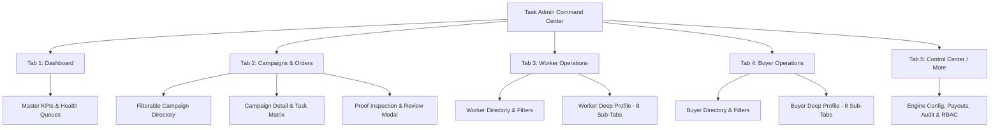
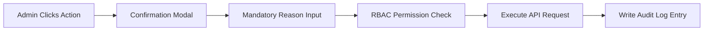

# 👑 Task Admin Command Center — Complete UI & Architecture Blueprint (`adminapp.md`)

## 📌 Executive Overview
The **Task Admin App** (`com.task.admin.earnpost`) is an enterprise-grade Command Center for managing the EarnPost Task Platform. It equips administrators with deep operational control over Worker Intelligence, Buyer Management, Order Engine Operations, Service Catalog Pricing, Finance & Payouts, Fraud Detection, and Real-time Auditing.

Every administrative operation follows a strict **Controlled Action & Reversal Workflow** backed by a **Granular Role-Based Access Control (RBAC)** permission matrix.

---

## 🎨 Design System & Theme Standards
- **Primary Color**: Royal Indigo (`#4F46E5` / `#4338CA`)
- **Accent / Highlight**: Deep Purple (`#7C3AED` / `#6D28D9`)
- **Status Colors**:
  - `ACTIVE` / `APPROVED` / `VERIFIED`: Emerald Green (`#10B981`)
  - `PENDING` / `UNDER_REVIEW` / `PAUSED`: Warm Amber (`#F59E0B`)
  - `SUSPENDED` / `BANNED` / `REJECTED` / `HIGH_RISK`: Crimson Red (`#EF4444`)
  - `INACTIVE` / `EXPIRED`: Muted Slate (`#64748B`)
- **Card Styling**: Clean white card surface (`#FFFFFF`) with 1px border (`#E5E7EB`) and soft 2px elevation shadow.

---

## 🗺️ Master Navigation Architecture (5 Core Tabs)



---

## 📱 Detailed Screen-by-Screen Blueprint

---

### 🟢 TAB 1: DASHBOARD (Master Command Center Overview)

#### Screen 1.1: `DashboardScreen`
- **Header**:
  - Admin Profile Avatar, Admin Role Tag (`SUPER_ADMIN` / `FINANCE_ADMIN`), Quick Notifications Bell.
  - Active Environment Switcher (`Production` vs `Staging`).
- **Urgent Action Banners**:
  - `3 Pending KYC Requests`, `14 Task Reviews Needed`, `5 Pending Payouts`.
- **Master KPI Summary Grid (9 Cards)**:
  1. **Total Workers**: Active vs Total Registered count.
  2. **Total Buyers**: Active vs Total Registered count.
  3. **Active Campaigns**: Orders currently executing.
  4. **Completed Campaigns**: Successfully finished campaigns.
  5. **Pending Reviews**: Submissions waiting for approval.
  6. **Pending KYC**: Identity verification requests in queue.
  7. **Pending Payouts**: Worker withdrawal requests in queue.
  8. **Gross Volume (`₹`)**: Total transaction volume processed on platform.
  9. **Platform Margin (`₹`)**: Total net platform profit earned.
- **Quick Action Row**:
  - `[ Verify KYC ]`, `[ Approve Payouts ]`, `[ Review Tasks ]`, `[ Add Service ]`.

---

### 🔵 TAB 2: CAMPAIGNS & ORDERS (Order Engine Operations)

#### Screen 2.1: `CampaignsListScreen`
- **Filter Pills**: `[ All ]` `[ Payment Pending ]` `[ Active ]` `[ Paused ]` `[ Completed ]` `[ Failed/Blocked ]`.
- **Search Bar**: Search by Order ID, Campaign Title, or Buyer Email.
- **Campaign Card Component (Admin Internal View)**:
  - Title, Buyer Name, Task Type Badge (e.g. `YOUTUBE_LIKE`).
  - Progress Bar (`450 / 1000 tasks completed - 45%`).
  - **Internal Admin Breakdown**: Buyer Unit Price (`₹2.00`) vs Platform Margin (`₹0.50`) vs Net Worker Reward (`₹1.50`).
  - Status Tag (`ACTIVE` green, `PAUSED` yellow, `COMPLETED` blue).
  - Expiry Date counter.

#### Screen 2.2: `CampaignDetailScreen`
- **Overview Card**: Description, JSON Requirements Viewer, Review Mode (`AUTO` / `MANUAL`).
- **Task Generation Matrix**: Total Required, Generated, Available, Assigned, Completed, Expired.
- **Action Toolbar**: `[ Pause ]`, `[ Resume ]`, `[ Extend Expiry ]`, `[ Cancel & Refund ]`, `[ Force Reallocate ]`.
- **Submissions List Tab**: List of generated tasks with worker avatar, time elapsed, and proof status.

#### Screen 2.3: `TaskReviewInspectorModal`
- **Submission Header**: Task ID, Worker Name, Worker Quality Score tag.
- **Proof Inspector**: Image/Screenshot zoom preview, submitted text/URL proof with copy button.
- **Review Decision Buttons**:
  - `[ Approve Task ]` -> Triggers Earning posting.
  - `[ Reject Task ]` -> Rejection reason code (`INVALID_PROOF`, `INCOMPLETE_STEP`, `DUPLICATE_SUBMISSION`) + notes.

---

### 🟡 TAB 3: WORKER OPERATIONS (Worker Intelligence & Deep Profile)

#### Screen 3.1: `WorkerDirectoryScreen`
- **Compact Worker List Card Component**:
  ```
  ┌──────────────────────────────────────────────────────────┐
  │ 🟢  Ahmed Khan                                   W-1024 │
  │     +91 XXXXXXXX12                                       │
  │                                                          │
  │ ⭐ 4.8    Score 92.5    Tasks 1,245                    │
  │ KYC ✓     ACTIVE                                         │
  │                                                          │
  │ Total Earned: ₹18,450         Available Balance: ₹2,350 │
  └──────────────────────────────────────────────────────────┘
  ```
- **Filter Pills**: `[ All ]` `[ Active ]` `[ Inactive ]` `[ KYC Pending ]` `[ KYC Rejected ]` `[ Suspended ]` `[ Banned ]` `[ High Risk ]`.
- **Search Bar**: Search by Worker ID (`W-1024`), Name, Phone, or Email.
- **Sorting Dropdown**: Highest Score, Highest Rating, Most Tasks Completed, Lowest Completion Rate, Highest Earnings, Recent Activity.

#### Screen 3.2: `WorkerDetailScreen` (8 Sub-Tabs Workflow)
Header: Worker Name, Worker ID, Status Tag, Quick Action Buttons (`[ Suspend ]`, `[ Ban ]`, `[ Change Status ]`).

1. **Sub-Tab 1: Overview**
   - **Account Meta**: Status, Joined Date, Last Active timestamp.
   - **Performance Metrics**: ⭐ Rating (`4.8`), Quality Score (`92.5`), Completion Rate (`96%`), Acceptance Rate (`94%`), Timeout Rate (`2%`), Rejection Rate (`3%`).
   - **Task Totals**: Total (`1,245`), Completed (`1,180`), In Progress (`12`), Rejected (`20`), Timed Out (`33`).
   - Quick Action Buttons: `[ Suspend ]`, `[ Ban ]`, `[ Change Status ]`, `[ View Tasks ]`.

2. **Sub-Tab 2: Tasks (Worker Task History)**
   - Filterable: `[ All ]` `[ Active ]` `[ Completed ]` `[ Rejected ]` `[ Timeout ]`.
   - List Tile: Task ID, Campaign Name, Reward Earned, Completed Date.
   - **Task Timeline Modal**: Shows linear progression: `Assigned` ➔ `Accepted` ➔ `Started` ➔ `Proof Submitted` ➔ `Under Review` ➔ `Approved (₹15 Earned)`. Proof Inspector embedded.

3. **Sub-Tab 3: KYC Verification**
   - Status Badge: `VERIFIED ✓` / `PENDING` / `REJECTED`.
   - Full Name, DOB, Document Type, Masked Document Number.
   - **Document Viewer Buttons**: `[ View Front ]`, `[ View Back ]` (Protected permission-controlled modal).
   - Verified By Admin Name & Verified Timestamp.
   - Actions: `[ Approve KYC ]`, `[ Reject KYC ]` with reason, `[ Request Re-KYC ]`.

4. **Sub-Tab 4: Earnings & Finance**
   - Financial Cards: Total Earned (`₹45,200`), Available Balance (`₹3,500`), Pending (`₹1,200`), Total Withdrawn (`₹40,500`).
   - **Transaction Stream**: List of earnings posted (+₹15 Task Approved) & withdrawals (-₹500 Withdrawal).
   - **Withdrawal History**: Request ID, Amount, Payment Method (`UPI` / `BANK`), Status (`REQUESTED`, `PROCESSING`, `PAID`, `REJECTED`).
   - Actions: `[ Process ]`, `[ Mark Paid ]`, `[ Reject Payout ]`.

5. **Sub-Tab 5: Ratings**
   - Rating Summary: ⭐ `4.8 / 5.0` (Histogram breakdown for 5⭐, 4⭐, 3⭐, 2⭐, 1⭐).
   - Recent Buyer Feedback List: Campaign Name, Rating Stars, Date, Buyer Feedback Text.

6. **Sub-Tab 6: Quality Score**
   - Overall Score: `92.5 / 100`.
   - Score Component Breakdown: Reliability (`95`), Completion (`96`), Rating (`94`), Experience (`85`), Consistency (`91`).
   - Historical Score Trend: Score logs by date (`Aug 10: 92.5`, `Aug 09: 91.8`).

7. **Sub-Tab 7: Risk & Anti-Fraud**
   - Risk Level: `LOW` / `MEDIUM` / `HIGH` (Risk Score `18 / 100`).
   - Fraud Signal Checklist: `✓ Normal completion speed`, `✓ Stable device fingerprint`, `✓ Good rating`, `✓ No suspicious IP switching`.
   - Incident Counts: Failed Tasks (`12`), Timeouts (`3`), Duplicate Proof Attempts (`0`).
   - Actions: `[ Suspend Worker ]`, `[ Ban Worker ]`, `[ Clear Warning ]`.

8. **Sub-Tab 8: Activity Stream**
   - Full Audit Log Timeline: Worker Logged In ➔ Task Accepted ➔ Proof Submitted ➔ Task Approved ➔ Earning Posted.

---

### 💜 TAB 4: BUYER OPERATIONS (Core Buyer Management & Analytics)

#### Screen 4.1: `BuyerDirectoryScreen`
- **Compact Buyer List Card Component**:
  ```
  ┌──────────────────────────────────────────────────────────┐
  │ 🟢  ABC Digital Pvt Ltd                          B-102  │
  │     contact@abc.com                                      │
  │                                                          │
  │ Orders 124        Active Campaigns 8                     │
  │ Total Spend ₹2.4L Status ACTIVE                         │
  └──────────────────────────────────────────────────────────┘
  ```
- **Filter Pills**: `[ All ]` `[ Active ]` `[ Suspended ]` `[ Blocked ]` `[ Payment Issues ]`.
- **Search Bar**: Search by Buyer ID (`B-102`), Company Name, Email, or Phone.

#### Screen 4.2: `BuyerDetailScreen` (8 Sub-Tabs Workflow)
Header: Company Name, Buyer ID, Status Badge (`ACTIVE` / `SUSPENDED`), Quick Actions (`[ Suspend ]`, `[ Block ]`, `[ More ]`).

1. **Sub-Tab 1: Overview**
   - **Company Details**: Business Name, GSTIN/Tax ID, Contact Email, Phone, Business Address.
   - **Order Summary**: Total Orders (`124`), Active Campaigns (`8`), Completed Campaigns (`109`).
   - **Financial Summary**: Total Spend (`₹2,40,000`), Pending Reviews (`23`).

2. **Sub-Tab 2: Orders & Campaigns**
   - Filterable: `[ All ]` `[ Active ]` `[ Pending ]` `[ Completed ]` `[ Cancelled ]`.
   - Campaign Card: Campaign ID, Title, Completion Bar (`450/500 - 90%`), Budget, Status.
   - Action Toolbar: `[ Pause ]`, `[ Resume ]`, `[ Extend ]`, `[ Cancel & Refund ]`, `[ Force Reallocate ]`.

3. **Sub-Tab 3: Tasks**
   - List of all tasks generated under Buyer's campaigns.
   - Details: Task ID, Campaign, Worker Name, Status, Submission Proof, Review Status, Reward.

4. **Sub-Tab 4: Payments & Ledger**
   - Financial Summary: Total Paid (`₹2,40,000`), Pending (`₹0`), Refunded (`₹5,000`).
   - Payment Transaction History List: Transaction ID (`PAY-1001`), Amount, Date, Status (`SUCCESS`).
   - Prepaid Credit Ledger: Current Prepaid Balance (`₹`), Reserved Balance vs Available Balance. Action: `[ Add Manual Credit / Refund ]`.

5. **Sub-Tab 5: Reviews History**
   - Breakdown of reviews executed by Buyer: Pending (`23`), Approved (`1,150`), Rejected (`45`), Request Changes (`12`).

6. **Sub-Tab 6: Analytics**
   - Total Orders (`124`), Completion Rate (`94%`), Average Campaign Budget (`500 tasks`), Total Spend (`₹2.4L`), Task Rejection Rate (`4.2%`), Average Review Time (`2h 12m`).

7. **Sub-Tab 7: Activity Stream**
   - Audit Log Timeline: Campaign Created ➔ Payment Made ➔ Campaign Paused ➔ Campaign Resumed ➔ Review Approved.

8. **Sub-Tab 8: Risk & Payment Issues**
   - Risk Score (`12 / 100`).
   - Payment Issues Count (`0`), Cancelled Orders (`2`), Refund Rate (`1.2%`).
   - Actions: `[ Suspend Buyer ]`, `[ Block Buyer ]`, `[ Add Admin Note ]`.

---

### ⚙️ TAB 5: CONTROL CENTER / MORE (Engine & System Admin)

#### Control Center Navigation Menu:
1. **Services & Pricing Engine**: Service catalog list, Create/Edit service, Buyer Price vs Margin (`FIXED ₹` or `PERCENTAGE %`) vs Net Worker Reward calculation, Live Preview Calculator.
2. **Matching Brain**: Engine status (`ONLINE`), Candidate worker pool ranking list, Rationale Inspector (Why Worker X selected vs Worker Y rejected), Used-worker exclusion policies.
3. **Payouts Management**: Pending worker withdrawals queue (UPI / Bank), `[ Approve Payout ]`, `[ Reject Payout ]`, `[ Bulk Approve ]`.
4. **KYC Management Queue**: Global list of pending worker identity verifications.
5. **Task Reviews Queue**: Global list of pending task proof reviews.
6. **Finance & Ledger**: Platform Gross Volume, Worker Disbursed Earnings, Net Platform Margin ledger.
7. **Risk & Fraud Control**: Flagged Workers, Suspicious Activity alerts, Anti-abuse rules.
8. **Audit Logs Stream**: Real-time audit log stream of all Admin and System actions.
9. **System Settings**: Platform configuration parameters & Maintenance Mode toggle.
10. **Notifications**: System announcement broadcaster to Workers or Buyers.
11. **Admin Profile**: Admin profile details & Security settings.

---

## 🛡️ Admin Controlled Action & Reversal System

### 1. Controlled Action Execution Flow
Every modifying administrative action MUST follow a strict multi-step safety flow:



### 2. Controlled Reversal / Undo Rules
Direct raw database deletions or uncoordinated rollbacks are **STRICTLY PROHIBITED**. Every action has an explicit, audit-tracked reversal workflow:

| Original Action | Reversal Action | Reversal Rule & Constraints |
|-----------------|-----------------|-----------------------------|
| **Suspend Worker** | `Reactivate Worker` | Restores worker status to `ACTIVE`. Preserves all score history & task logs. |
| **Ban Worker** | `Unban Worker` | Requires `SUPER_ADMIN` approval & mandatory reason note. |
| **Pause Campaign** | `Resume Campaign` | Re-enables task allocation in Matching Engine. |
| **Cancel Campaign** | `Refund Unused Budget` | Calculates unassigned/uncompleted tasks & posts refund credit to Buyer ledger. Cannot be undone once refunded. |
| **Force Reallocate Task** | `Reassign Task` | Releases current assignment, increments attempt count, preserves original attempt in assignment history. |
| **Reject Payout** | `Re-queue Payout` | Restores withdrawal request status to `REQUESTED` and returns funds to Available Balance if rejected in error. |
| **Mark Payout Paid** | `Payment Refund / Dispute` | Cannot be directly unmarked; must initiate formal financial dispute log. |

---

## 🔐 Granular Admin RBAC Permission Matrix

The platform enforces 6 distinct Admin Roles to ensure principle of least privilege:

| Feature / Action | `SUPER_ADMIN` | `ADMIN` | `OPERATIONS_ADMIN` | `FINANCE_ADMIN` | `KYC_ADMIN` | `SUPPORT_ADMIN` |
|------------------|:-------------:|:-------:|:------------------:|:--------------:|:-----------:|:---------------:|
| **View Dashboard & Analytics** | ✅ | ✅ | ✅ | ✅ | ✅ | ✅ |
| **View Worker / Buyer Profiles** | ✅ | ✅ | ✅ | ✅ | ✅ | ✅ |
| **Approve / Reject KYC** | ✅ | ✅ | ❌ | ❌ | ✅ | ❌ |
| **Suspend / Ban Workers** | ✅ | ✅ | ✅ | ❌ | ❌ | ❌ |
| **Unban Worker** | ✅ | ❌ | ❌ | ❌ | ❌ | ❌ |
| **Approve / Reject Task Reviews**| ✅ | ✅ | ✅ | ❌ | ❌ | ❌ |
| **Pause / Resume / Cancel Orders**| ✅ | ✅ | ✅ | ❌ | ❌ | ❌ |
| **Approve Worker Withdrawals** | ✅ | ✅ | ❌ | ✅ | ❌ | ❌ |
| **Add Buyer Credit / Refunds** | ✅ | ✅ | ❌ | ✅ | ❌ | ❌ |
| **Create / Edit Service Pricing**| ✅ | ✅ | ❌ | ❌ | ❌ | ❌ |
| **Configure Matching Engine** | ✅ | ✅ | ✅ | ❌ | ❌ | ❌ |
| **View Full Audit Logs** | ✅ | ✅ | ❌ | ❌ | ❌ | ❌ |
| **Manage Admin Users & Roles** | ✅ | ❌ | ❌ | ❌ | ❌ | ❌ |

---

## ⚡ Active NestJS Backend API Endpoint Mapping

| Domain | Feature / Screen | HTTP Method & Endpoint Path |
|--------|-----------------|-----------------------------|
| **Auth** | Admin Login | `POST /api/v1/auth/login` |
| **Auth** | Refresh Token | `POST /api/v1/auth/refresh` |
| **Auth** | Get Admin Profile | `GET /api/v1/auth/me` |
| **Dashboard** | Master Overview | `GET /api/v1/admin/dashboard` |
| **Dashboard** | Orders Breakdown | `GET /api/v1/admin/dashboard/orders` |
| **Dashboard** | Tasks Breakdown | `GET /api/v1/admin/dashboard/tasks` |
| **Dashboard** | Workers Breakdown | `GET /api/v1/admin/dashboard/workers` |
| **Dashboard** | Earnings Breakdown | `GET /api/v1/admin/dashboard/earnings` |
| **Campaigns** | List All Orders | `GET /api/v1/admin/orders` |
| **Campaigns** | Order Details | `GET /api/v1/admin/orders/{id}` |
| **Campaigns** | Update Order Status | `PATCH /api/v1/admin/orders/{id}` |
| **Task Review** | Pending Reviews | `GET /api/v1/admin/reviews/pending` |
| **Task Review** | Review Decision | `POST /api/v1/admin/reviews/{id}/decision` |
| **Workers** | List Workers | `GET /api/v1/admin/workers` |
| **Workers** | Worker Details | `GET /api/v1/admin/workers/{id}` |
| **Workers** | Update Worker Status | `PATCH /api/v1/admin/workers/{id}/status` |
| **Workers** | Pending KYC List | `GET /api/v1/admin/kyc/pending` |
| **Workers** | KYC Decision | `POST /api/v1/admin/kyc/{id}/decision` |
| **Buyers** | List Buyers | `GET /api/v1/admin/buyers` |
| **Buyers** | Buyer Details | `GET /api/v1/admin/buyers/{id}` |
| **Buyers** | Add Buyer Credit | `POST /api/v1/admin/buyers/{id}/credit` |
| **Services** | List Services | `GET /api/v1/admin/services` |
| **Services** | Create Service | `POST /api/v1/admin/services` |
| **Services** | Create Pricing Version | `POST /api/v1/admin/services/{id}/pricing` |
| **Services** | Pricing History | `GET /api/v1/admin/services/{id}/pricing/history` |
| **Matching** | Candidate Rationale | `GET /api/v1/admin/engine/matching/candidates/{orderId}` |
| **Payouts** | Pending Withdrawals | `GET /api/v1/admin/payouts/pending` |
| **Payouts** | Approve Payout | `POST /api/v1/admin/payouts/{id}/approve` |
| **Audit** | Audit Logs | `GET /api/v1/admin/audit-logs` |

---

## 🚀 Clean Architecture Directory Structure

```
Admin app/lib/
├── core/
│   ├── constants/ (AppConstants, AppColors, Enums, Roles)
│   ├── network/ (DioClient, ApiEndpoints, Interceptors)
│   ├── storage/ (SecureStorage, LocalStorage)
│   ├── theme/ (AppTheme, Typography)
│   └── di/ (GetIt Service Locator)
├── features/
│   ├── auth/ (Data, Domain, BLoC, LoginScreen)
│   ├── dashboard/ (Data, Domain, BLoC, DashboardScreen)
│   ├── orders/ (Data, Domain, BLoC, CampaignsList, Detail, ReviewModal)
│   ├── workers/ (Data, Domain, BLoC, WorkerDirectory, WorkerDetail-8SubTabs)
│   ├── buyers/ (Data, Domain, BLoC, BuyerDirectory, BuyerDetail-8SubTabs)
│   └── control_center/ (ServicesCatalog, MatchingBrain, Payouts, AuditLogs)
└── main.dart
```

This specification represents the **100% complete Command Center Blueprint & Architecture Specification** for the Task Admin Flutter Application! 👑
