# 👑 Task Admin Flutter App — Core Platform Blueprint & Specification (`adminapp.md`)

## 📌 Executive Overview
The **Task Admin App** (`com.task.admin.earnpost`) is the central command center for managing the EarnPost Task Platform. It provides full control over Core Buyer Management, Worker Operations, Task Engine Matching Brain, Service Catalog & Pricing Engine, Finance & Payouts, Fraud Detection, and Real-time System Auditing.

> [!NOTE]
> **SaaS & External Developer API features** (API Keys Manager, Webhooks Subscriptions, Developer Portal, API Usage Metrics) have been **completely removed** from the current active Admin App blueprint and will be added later as an isolated add-on module.

---

## 🎨 Design System & Theme Token Standards
- **Color Palette**:
  - **Primary**: Royal Indigo (`#4F46E5` / `#4338CA`)
  - **Secondary / Accent**: Deep Purple (`#7C3AED` / `#6D28D9`)
  - **Success / Active**: Emerald Green (`#10B981`)
  - **Warning / Review**: Warm Amber (`#F59E0B`)
  - **Danger / Alert**: Crimson Red (`#EF4444`)
  - **Background**: Soft Neutral Grey (`#F9FAFB`)
  - **Card / Surface**: Crisp Pure White (`#FFFFFF`) with subtle 1px border (`#E5E7EB`)
- **Typography**: Inter / Outfit Sans-Serif font family with strict hierarchical text scaling.

---

## 🗺️ Bottom Navigation Structure (5 Core Tabs)

```mermaid
graph TD
    Root[Task Admin Navigation] --> Tab1[Tab 1: Dashboard]
    Root --> Tab2[Tab 2: Campaigns & Orders]
    Root --> Tab3[Tab 3: Workers]
    Root --> Tab4[Tab 4: Buyers]
    Root --> Tab5[Tab 5: Control Center / More]

    Tab1 --> D1[Master Overview KPIs]
    Tab1 --> D2[Platform Queues & Alert Banners]
    Tab1 --> D3[Financial Volume & Margins]

    Tab2 --> C1[Filterable Campaign List]
    Tab2 --> C2[Campaign Detail & Task Matrix]
    Tab2 --> C3[Task Review & Proof Inspector Modal]

    Tab3 --> W1[Worker Directory]
    Tab3 --> W2[Worker Profile & KYC Modal]
    Tab3 --> W3[Quality Score & Risk Assessment]

    Tab4 --> B1[Buyer Management Directory]
    Tab4 --> B2[Buyer Profile & Campaign History]
    Tab4 --> B3[Buyer Balance & Payments Ledger]

    Tab5 --> M1[Service & Pricing Engine]
    Tab5 --> M2[Matching Brain & Candidate Audit]
    Tab5 --> M3[Payout Approval Queue]
    Tab5 --> M4[Finance, Audit Logs & Settings]
```



---

## 📱 Detailed Screen-by-Screen Blueprint

### 🟢 TAB 1: DASHBOARD (Master Platform Overview)

#### Screen 1.1: `DashboardScreen`
- **Header**:
  - Admin Welcome Avatar with Quick Notification Badge icon.
  - Active Environment Badge (`Production / Staging`).
- **Real-Time Alert Banner**:
  - Dynamic cards highlighting urgent queues: `Pending KYC Queue`, `Task Reviews Needed`, `Pending Payouts`.
- **Master KPI Summary Grid**:
  1. **Total Workers**: Active vs Total Registered Workers count.
  2. **Total Buyers**: Active vs Total Registered Buyers count.
  3. **Active Campaigns**: Orders in progress count.
  4. **Completed Campaigns**: Orders finished count.
  5. **Pending Reviews**: Submissions waiting for approval count.
  6. **Pending KYC**: Worker identity verification requests count.
  7. **Pending Payouts**: Worker withdrawal requests count.
  8. **Gross Volume (`₹`)**: Total transaction volume processed on platform.
  9. **Platform Margin (`₹`)**: Total net platform profit earned.
- **Quick Action Bar**:
  - `[ Verify KYC ]`, `[ Approve Payouts ]`, `[ Review Tasks ]`, `[ Add Service ]`.

---

### 🔵 TAB 2: CAMPAIGNS & ORDERS (Order Engine Operations)

#### Screen 2.1: `CampaignsListScreen`
- **Filter Pills**: `[ All ]` `[ Payment Pending ]` `[ Active ]` `[ Paused ]` `[ Completed ]` `[ Failed/Blocked ]`.
- **Search Bar**: Search by Order ID, Campaign Title, or Buyer Email.
- **Campaign Card Component (Admin Internal View)**:
  - Title, Buyer Name, Task Type Badge (e.g. `YOUTUBE_LIKE`).
  - Completion Progress Bar (`450 / 1000 tasks completed`).
  - **Internal Financial Breakdown (Admin Only)**: Buyer Unit Price (`₹2.00`) vs Platform Margin (`₹0.50`) vs Net Worker Reward (`₹1.50`).
  - Status Tag with color coding (`ACTIVE` green, `PAUSED` yellow, `COMPLETED` blue).
  - Expiry Date counter.

#### Screen 2.2: `CampaignDetailScreen`
- **Overview Card**: Full description, requirements JSON viewer, review mode (`AUTO` vs `MANUAL`).
- **Task Generation Matrix**:
  - Total tasks required, Generated count, Available count, Assigned count, Completed count, Expired count.
- **Action Toolbar**:
  - `[ Pause Campaign ]`, `[ Extend Campaign Expiry ]`, `[ Cancel & Refund ]`, `[ Force Reallocate ]`.
- **Submissions List Tab**:
  - List of all task submissions generated under this campaign with worker avatar, time elapsed, and proof status.

#### Screen 2.3: `TaskReviewInspectorModal`
- **Submission Header**: Task ID, Worker Name, Quality Score badge.
- **Proof Viewer**:
  - Image/Screenshot preview with full-screen zoom modal.
  - Submitted text / URL proofs with copy button.
- **Review Decision Buttons**:
  - `[ Approve Task ]` -> Automatically triggers Earning posting.
  - `[ Reject Task ]` -> Rejection reason code dropdown (`INVALID_PROOF`, `INCOMPLETE_STEP`, `DUPLICATE_SUBMISSION`) + feedback notes.

---

### 🟡 TAB 3: WORKER OPERATIONS (Worker Intelligence & Risk)

#### Screen 3.1: `WorkerDirectoryScreen`
- **Filter Bar**: `[ All ]` `[ Active ]` `[ Inactive ]` `[ Pending KYC ]` `[ High Risk / Banned ]`.
- **Search Bar**: Search worker by Name, Phone, Email, or Worker ID.
- **Worker List Tile**:
  - Profile Avatar, Full Name, Phone number.
  - Status Badge (`ACTIVE` green, `BANNED` red, `KYC_PENDING` yellow).
  - Success Rate % tag, Total Tasks Completed, Quality Score (`0 - 100`).

#### Screen 3.2: `WorkerProfileDetailScreen`
- **Tabbed Layout**:
  - **Tab A: Overview & Stats**: Quality Score breakdown (Experience, Reliability, Rating, Completion).
  - **Tab B: KYC Verification Modal**:
    - Document Type (Aadhaar / PAN / Passport), Document Number.
    - Document Front & Back images preview.
    - Action: `[ Verify KYC ]` or `[ Reject KYC ]` with reason text input.
  - **Tab C: Task Execution History**: Table of completed, rejected, and timed-out task assignments.
  - **Tab D: Financial & Withdrawal History**: Total Earnings (`₹`), Available Wallet Balance, Withdrawal Requests list.
  - **Tab E: Risk & Anti-Fraud**:
    - Risk Score Card (`Low Risk 0-30`, `Medium Risk 31-70`, `High Risk 71-100`).
    - Device Fingerprint history, IP logs.
    - Action: `[ Suspend Worker ]` / `[ Ban Worker ]`.

---

### 💜 TAB 4: BUYER MANAGEMENT (Core Platform Buyer Operations)

> [!IMPORTANT]
> **No SaaS / API features**. Purely core platform Buyer account management, spending analytics, campaign history, and prepaid balance ledger.

#### Screen 4.1: `BuyerDirectoryScreen`
- **Search & Filter**: Search buyer by Company Name, Email, or Phone.
- **Buyer List Tile**:
  - Business / Company Name, Contact Person Email.
  - Account Status Badge (`ACTIVE` green, `SUSPENDED` red).
  - Total Platform Spend (`₹`), Total Campaigns Created, Current Prepaid Balance (`₹`).

#### Screen 4.2: `BuyerDetailScreen`
- **Business Profile Overview**: Business Name, GSTIN/Tax ID, Address, Phone, Email.
- **Buyer Status & Control**:
  - Status Toggle (`ACTIVE` / `SUSPENDED`).
- **Buyer Campaign History**:
  - List of all campaigns created by this buyer with completion status and total spend per campaign.
- **Buyer Payments & Spending Analytics**:
  - Total Money Deposited (`₹`), Total Spend (`₹`), Average Campaign Budget (`₹`).
- **Buyer Prepaid Ledger & Credit Management**:
  - Current Prepaid Credit Balance (`₹`).
  - Reserved Balance (Locked in active campaigns) vs Available Balance.
  - Action: `[ Add Manual Credit / Refund ]` modal with reason notes.

---

### ⚙️ TAB 5: CONTROL CENTER / MORE (Engine & System Admin)

#### Control Center Navigation Menu:
1. **Services & Pricing Engine**:
   - Service Catalog list (e.g. `YOUTUBE_LIKE`, `APP_INSTALL`).
   - Create / Edit Service definition.
   - Buyer Price vs Margin (`FIXED ₹` or `PERCENTAGE %`) vs Net Worker Reward calculation.
   - Live Preview Calculator & Historical Version Timeline.
2. **Matching Brain**:
   - Engine Status Dashboard & Candidate Worker Ranking list.
   - Candidate Rationale Inspector: Rationale for selecting Worker X vs rejecting Worker Y.
   - Used-Worker Exclusion & Reallocation Policies setup.
3. **Payouts Management**:
   - Pending Worker Withdrawals queue (Bank / UPI details).
   - `[ Approve Payout ]`, `[ Reject Payout ]`, `[ Bulk Approve All ]`.
4. **KYC Management Queue**:
   - Global list of all pending worker identity verifications.
5. **Task Reviews Queue**:
   - Global list of all pending task proof reviews.
6. **Finance & Ledger**:
   - Platform Gross Revenue, Worker Disbursed Earnings, Net Platform Profit ledger.
7. **Risk & Fraud Control**:
   - Suspicious activity alerts, Flagged Workers, Anti-abuse rules.
8. **Audit Logs Stream**:
   - Real-time audit stream of all Admin & System actions with IP logs.
9. **System Settings**:
   - Platform configuration parameters & Maintenance Mode toggle.
10. **Notifications**:
    - System announcement broadcaster to Workers or Buyers.
11. **Admin Profile**:
    - Admin user profile details & Security settings.

---

## 🚫 EXPLICITLY REMOVED MODULES (SaaS Exclusions)
The following SaaS/Developer features have been **completely removed**:
- ❌ Buyer SaaS Portal
- ❌ API Keys Manager (Generation, Rotation, Revocation)
- ❌ Webhooks Manager & Event Subscriptions
- ❌ API Tiers (Starter, Enterprise)
- ❌ API Usage & Throttle Metrics
- ❌ External API Created Orders Log
- ❌ Developer Portal Management
- ❌ Webhook Delivery Logs & Retry Engine

---

## ⚡ Active NestJS Backend API Endpoint Mapping

| Domain | Feature / Screen | HTTP Method & Endpoint Path |
|--------|-----------------|-----------------------------|
| **Auth** | Login | `POST /api/v1/auth/login` |
| **Auth** | Refresh Token | `POST /api/v1/auth/refresh` |
| **Auth** | Get Profile | `GET /api/v1/auth/me` |
| **Dashboard** | Master Overview | `GET /api/v1/admin/dashboard` |
| **Dashboard** | Orders Breakdown | `GET /api/v1/admin/dashboard/orders` |
| **Dashboard** | Tasks Breakdown | `GET /api/v1/admin/dashboard/tasks` |
| **Dashboard** | Workers Breakdown | `GET /api/v1/admin/dashboard/workers` |
| **Dashboard** | Earnings Breakdown | `GET /api/v1/admin/dashboard/earnings` |
| **Campaigns** | List All Orders | `GET /api/v1/admin/orders` |
| **Campaigns** | Order Details | `GET /api/v1/admin/orders/{id}` |
| **Campaigns** | Update Order Status | `PATCH /api/v1/admin/orders/{id}` |
| **Task Review** | Pending Reviews | `GET /api/v1/admin/reviews/pending` |
| **Task Review** | Review Decision | `POST /api/v1/admin/reviews/{id}/decision` |
| **Workers** | List Workers | `GET /api/v1/admin/workers` |
| **Workers** | Worker Details | `GET /api/v1/admin/workers/{id}` |
| **Workers** | Update Worker Status | `PATCH /api/v1/admin/workers/{id}/status` |
| **Workers** | Pending KYC List | `GET /api/v1/admin/kyc/pending` |
| **Workers** | KYC Decision | `POST /api/v1/admin/kyc/{id}/decision` |
| **Buyers** | List Buyers | `GET /api/v1/admin/buyers` |
| **Buyers** | Buyer Details | `GET /api/v1/admin/buyers/{id}` |
| **Buyers** | Add Buyer Balance | `POST /api/v1/admin/buyers/{id}/credit` |
| **Services** | List Services | `GET /api/v1/admin/services` |
| **Services** | Create Service | `POST /api/v1/admin/services` |
| **Services** | Create Pricing Version | `POST /api/v1/admin/services/{id}/pricing` |
| **Services** | Pricing History | `GET /api/v1/admin/services/{id}/pricing/history` |
| **Matching** | Candidate Rationale | `GET /api/v1/admin/engine/matching/candidates/{orderId}` |
| **Payouts** | Pending Withdrawals | `GET /api/v1/admin/payouts/pending` |
| **Payouts** | Approve Payout | `POST /api/v1/admin/payouts/{id}/approve` |
| **Audit** | Audit Logs | `GET /api/v1/admin/audit-logs` |

---

## 🚀 Clean Architecture State Management (BLoC & DI Structure)

```
Admin app/lib/
├── core/
│   ├── constants/ (AppConstants, AppColors, Enums)
│   ├── network/ (DioClient, ApiEndpoints, Interceptors)
│   ├── storage/ (SecureStorage, LocalStorage)
│   ├── theme/ (AppTheme, Typography)
│   └── di/ (GetIt Service Locator)
├── features/
│   ├── auth/ (Data, Domain, BLoC, LoginScreen)
│   ├── dashboard/ (Data, Domain, BLoC, DashboardScreen)
│   ├── orders/ (Data, Domain, BLoC, CampaignsList, Detail, ReviewModal)
│   ├── workers/ (Data, Domain, BLoC, WorkerDirectory, ProfileDetail, KYCModal)
│   ├── buyers/ (Data, Domain, BLoC, BuyerDirectory, Detail, PrepaidLedger)
│   └── control_center/ (ServicesCatalog, MatchingBrain, Payouts, AuditLogs)
└── main.dart
```

This specification represents the **100% clean, core platform blueprint** for the Task Admin Flutter Application! 👑
