# 👑 Task Admin Flutter App — Complete UI Blueprint & Architecture Specification (`adminapp.md`)

## 📌 Executive Overview
The **Task Admin App** (`com.task.admin.earnpost`) is the central command center for managing the EarnPost Task Platform. It controls multi-tenant SaaS Buyers, Worker operations, Task Engine matching brain, Service Catalog pricing, Finance & Payouts, Fraud detection, and Real-time Auditing.

This document serves as the **100% complete UI Blueprint, Navigation Flow, Screen Breakdown, and API Contract Mapping** for the Flutter Admin Application.

---

## 🎨 Design System & Theme Token Standards
- **Color Palette**:
  - **Primary**: Royal Indigo (`#4F46E5` / `#4338CA`)
  - **Secondary / Accent**: Deep Purple (`#7C3AED` / `#6D28D9`)
  - **Success / Active**: Emerald Green (`#10B981`)
  - **Warning / Review**: Warm Amber (`#F59E0B`)
  - **Danger / Alert**: Crimson Red (`#EF4444`)
  - **Background**: Soft Neutral Grey (`#F9FAFB`)
  - **Card / Surface**: Crisp Pure White (`#FFFFFF`) with subtle 1px border (`#E5E7EB`)
- **Typography**: Inter / Outfit Sans-Serif font family with strict hierarchical text scaling.

---

## 🗺️ Bottom Navigation Structure (5 Core Tabs)

```mermaid
graph TD
    Root[Task Admin Navigation] --> Tab1[Tab 1: Dashboard]
    Root --> Tab2[Tab 2: Campaigns & Orders]
    Root --> Tab3[Tab 3: Worker Operations]
    Root --> Tab4[Tab 4: Buyer SaaS]
    Root --> Tab5[Tab 5: Control Center / More]

    Tab1 --> D1[Master Overview KPIs]
    Tab1 --> D2[Alert Banners]
    Tab1 --> D3[Financial Quick Stats]

    Tab2 --> C1[Filterable Campaign List]
    Tab2 --> C2[Campaign Detail & Task Matrix]
    Tab2 --> C3[Task Review & Proof Inspector Modal]

    Tab3 --> W1[Worker Directory]
    Tab3 --> W2[Deep Worker Profile]
    Tab3 --> W3[KYC Verification Modal]
    Tab3 --> W4[Score & Risk Breakdown]

    Tab4 --> B1[Buyer SaaS Directory]
    Tab4 --> B2[API Keys & Webhooks Manager]
    Tab4 --> B3[Buyer Ledger & Billing]

    Tab5 --> M1[Service & Pricing Engine]
    Tab5 --> M2[Matching Brain & Candidate Audit]
    Tab5 --> M3[Payout & Withdrawal Approval Queue]
    Tab5 --> M4[System Audit Logs & Settings]
```



---

## 📱 Detailed Screen-by-Screen Blueprint

### 🟢 TAB 1: DASHBOARD (Master Platform Overview)

#### Screen 1.1: `DashboardScreen`
- **Header**:
  - Admin Welcome Avatar with Quick Notification Badge icon.
  - Active Environment Badge (`Production / Staging`).
- **Real-Time Alert Banner**:
  - Dynamic cards highlighting urgent queues: `3 Pending KYC Requests`, `14 Task Reviews Needed`, `5 Pending Payouts`.
- **KPI Summary Grid (4 Cards)**:
  1. **Total Users**: Total Workers vs Total Buyers count with growth trend.
  2. **Active Campaigns**: Orders in progress vs completed count.
  3. **Gross Platform Volume**: Total money flowing through platform (`₹`).
  4. **System Net Margin**: Calculated platform profit (`₹`).
- **Platform Queues Health Widget**:
  - Horizontal progress indicators for Review Queue, KYC Verification Queue, and Payout Approval Queue.
- **Quick Action Row**:
  - `[ Verify KYC ]`, `[ Approve Payouts ]`, `[ Review Tasks ]`, `[ Add Service ]`.

---

### 🔵 TAB 2: CAMPAIGNS & ORDERS (Order Engine Operations)

#### Screen 2.1: `CampaignsListScreen`
- **Filter Pills**: `[ All ]` `[ Payment Pending ]` `[ Active ]` `[ Paused ]` `[ Completed ]` `[ Failed/Blocked ]`.
- **Search Bar**: Search by Order ID, Campaign Title, or Buyer Email.
- **Campaign Card Component**:
  - Title, Buyer Name, Task Type Badge (e.g. `YOUTUBE_LIKE`).
  - Completion Progress Bar (`450 / 1000 tasks completed`).
  - Unit Price vs Worker Reward breakdown.
  - Status Tag with color coding.
  - Expiry Date counter.

#### Screen 2.2: `CampaignDetailScreen`
- **Overview Card**: Full description, requirements JSON format viewer, review mode (`AUTO` vs `MANUAL`).
- **Task Generation Matrix**:
  - Total tasks required, Generated count, Available count, Assigned count, Completed count, Expired count.
- **Action Toolbar**:
  - `[ Pause Campaign ]`, `[ Extend Campaign Expiry ]`, `[ Cancel & Refund ]`, `[ Force Reallocate ]`.
- **Submissions List Tab**:
  - List of all task submissions generated under this campaign with worker avatar, time elapsed, and proof status.

#### Screen 2.3: `TaskReviewInspectorModal`
- **Submission Header**: Task ID, Worker Name, Quality Score badge.
- **Proof Viewer**:
  - Image/Screenshot preview with full-screen zoom modal.
  - Submitted text / URL proofs with copy button.
- **Review Decision Buttons**:
  - `[ Approve Task ]` -> Automatically triggers Earning posting.
  - `[ Reject Task ]` -> Rejection reason code dropdown (`INVALID_PROOF`, `INCOMPLETE_STEP`, `DUPLICATE_SUBMISSION`) + feedback notes.

---

### 🟡 TAB 3: WORKER OPERATIONS (Worker Intelligence & Risk)

#### Screen 3.1: `WorkerDirectoryScreen`
- **Filter Bar**: `[ All ]` `[ Active ]` `[ Inactive ]` `[ Pending KYC ]` `[ High Risk / Banned ]`.
- **Search Bar**: Search worker by Name, Phone, Email, or Worker ID.
- **Worker List Tile**:
  - Profile Avatar, Full Name, Phone number.
  - Status Badge (`ACTIVE` green, `BANNED` red, `KYC_PENDING` yellow).
  - Success Rate % tag, Total Tasks Completed, Quality Score (`0 - 100`).

#### Screen 3.2: `WorkerProfileDetailScreen`
- **Tabbed Layout**:
  - **Tab A: Overview & Stats**: Quality Score breakdown (Experience, Reliability, Rating, Completion).
  - **Tab B: KYC Verification**:
    - Document Type (Aadhaar / PAN / Passport), Document Number.
    - Document Front & Back images preview.
    - Action: `[ Verify KYC ]` or `[ Reject KYC ]` with reason text input.
  - **Tab C: Task Execution History**: Full table of completed, rejected, and timed-out task assignments.
  - **Tab D: Financial Ledger**: Total Earnings, Available Wallet Balance, Withdrawal History list.
  - **Tab E: Risk & Anti-Fraud**:
    - Risk Score Card (`Low Risk 0-30`, `Medium Risk 31-70`, `High Risk 71-100`).
    - Device Fingerprint history, IP logs, Action: `[ Suspend Worker ]` / `[ Ban Worker ]`.

---

### 💜 TAB 4: BUYER SAAS OPERATIONS (B2B SaaS Management)

#### Screen 4.1: `BuyerDirectoryScreen`
- **Buyer List Tile**:
  - Business / Company Name, Contact Person Email.
  - Account Status (`ACTIVE`, `SUSPENDED`).
  - Total Spend (`₹`), Active Campaigns Count, API Tier (`Starter`, `Enterprise`).

#### Screen 4.2: `BuyerDetailScreen`
- **Business Profile Overview**: Tax ID / GSTIN, Business Address, Contact Details.
- **API Keys Manager Widget**:
  - Active API Key list with masked key (`sk_live_****8f9a`).
  - Action: `[ Generate New Key ]`, `[ Rotate Key ]`, `[ Revoke Key ]`.
- **Webhook Subscriptions & Logs**:
  - Webhook Endpoint URL, Event Subscriptions (`order.created`, `task.completed`, `payment.captured`).
  - Webhook Delivery History list with response status codes (`200 OK`, `500 Error`) and `[ Retry Delivery ]` button.
- **Buyer Financial Ledger & Billing**:
  - Current Prepaid Credit Balance (`₹`).
  - Reserved Balance (Locked in active campaigns) vs Available Balance.
  - Action: `[ Add Manual Credit ]` modal, Invoice PDF viewer.

---

### ⚙️ TAB 5: CONTROL CENTER & MORE (Engine & System Admin)

#### Screen 5.1: `ServiceCatalogScreen`
- **Service Catalog List**:
  - Code (e.g. `YOUTUBE_LIKE`), Service Name, Active Status Toggle.
  - Current Active Pricing Version, Buyer Unit Price, Margin Type (`FIXED` vs `PERCENTAGE`), Worker Reward.
- **Modal: `CreateEditServiceModal`**:
  - Form inputs: Service Code, Name, Description.
  - Buyer Price field, Margin Selector (`FIXED ₹` or `PERCENTAGE %`), Margin Value.
  - **Live Preview Calculator**: Real-time display showing exact Buyer Price, Calculated Margin, and Net Worker Reward before saving.
- **Modal: `PricingHistoryModal`**:
  - Timeline of all historical pricing versions with effective dates and change author.

#### Screen 5.2: `MatchingBrainScreen`
- **Engine Status Dashboard**:
  - Matching Engine status (`ONLINE`), Allocation Queue load.
- **Worker Scoring & Candidate Selection Audit**:
  - Input Order ID -> View candidate worker pool ranking list.
  - Rationale Inspector: Shows exact reason why **Worker X** was selected (high score 92.5) vs why **Worker Y** was rejected (already completed task under same campaign / low rating).
- **Used-Worker Exclusion & Reallocation Policies**:
  - Configure timeout hours (`timeToAcceptHours`, `timeToCompleteHours`).

#### Screen 5.3: `PayoutManagementScreen`
- **Pending Withdrawals Queue**:
  - Worker Name, Payment Method Type (`UPI` / `BANK`), Masked UPI ID / Account Number.
  - Requested Amount (`₹`), Requested Time.
  - Actions: `[ Approve Payout ]` -> Triggers Bank Transfer, `[ Reject Payout ]` with reason, `[ Bulk Approve All ]`.

#### Screen 5.4: `AuditLogsScreen`
- **Real-Time Audit Stream**:
  - Timestamp, Actor Name & Role (`ADMIN`, `SYSTEM`), Action Code (`SERVICE_CREATED`, `WORKER_BANNED`, `PAYOUT_APPROVED`), IP Address, User Agent.

---

## ⚡ Complete NestJS Backend API Endpoint Mapping

| Domain | Feature / Screen | HTTP Method & Endpoint Path |
|--------|-----------------|-----------------------------|
| **Auth** | Login | `POST /api/v1/auth/login` |
| **Auth** | Refresh Token | `POST /api/v1/auth/refresh` |
| **Auth** | Get Profile | `GET /api/v1/auth/me` |
| **Dashboard** | Master Overview | `GET /api/v1/admin/dashboard` |
| **Dashboard** | Orders Breakdown | `GET /api/v1/admin/dashboard/orders` |
| **Dashboard** | Tasks Breakdown | `GET /api/v1/admin/dashboard/tasks` |
| **Dashboard** | Workers Breakdown | `GET /api/v1/admin/dashboard/workers` |
| **Dashboard** | Earnings Breakdown | `GET /api/v1/admin/dashboard/earnings` |
| **Campaigns** | List All Orders | `GET /api/v1/admin/orders` |
| **Campaigns** | Order Details | `GET /api/v1/admin/orders/{id}` |
| **Campaigns** | Update Order Status | `PATCH /api/v1/admin/orders/{id}` |
| **Task Review** | Pending Reviews | `GET /api/v1/admin/reviews/pending` |
| **Task Review** | Review Decision | `POST /api/v1/admin/reviews/{id}/decision` |
| **Workers** | List Workers | `GET /api/v1/admin/workers` |
| **Workers** | Worker Details | `GET /api/v1/admin/workers/{id}` |
| **Workers** | Update Worker Status | `PATCH /api/v1/admin/workers/{id}/status` |
| **Workers** | Pending KYC List | `GET /api/v1/admin/kyc/pending` |
| **Workers** | KYC Decision | `POST /api/v1/admin/kyc/{id}/decision` |
| **Buyers** | List Buyers | `GET /api/v1/admin/buyers` |
| **Buyers** | Buyer Details | `GET /api/v1/admin/buyers/{id}` |
| **Buyers** | Add Buyer Balance | `POST /api/v1/admin/buyers/{id}/credit` |
| **Services** | List Services | `GET /api/v1/admin/services` |
| **Services** | Create Service | `POST /api/v1/admin/services` |
| **Services** | Create Pricing Version | `POST /api/v1/admin/services/{id}/pricing` |
| **Services** | Pricing History | `GET /api/v1/admin/services/{id}/pricing/history` |
| **Matching** | Candidate Rationale | `GET /api/v1/admin/engine/matching/candidates/{orderId}` |
| **Payouts** | Pending Withdrawals | `GET /api/v1/admin/payouts/pending` |
| **Payouts** | Approve Payout | `POST /api/v1/admin/payouts/{id}/approve` |
| **Audit** | Audit Logs | `GET /api/v1/admin/audit-logs` |

---

## 🚀 Clean Architecture State Management (BLoC & DI Structure)

```
Admin app/lib/
├── core/
│   ├── constants/ (AppConstants, AppColors, Enums)
│   ├── network/ (DioClient, ApiEndpoints, Interceptors)
│   ├── storage/ (SecureStorage, LocalStorage)
│   ├── theme/ (AppTheme, Typography)
│   └── di/ (GetIt Service Locator)
├── features/
│   ├── auth/ (Data, Domain, BLoC, LoginScreen)
│   ├── dashboard/ (Data, Domain, BLoC, DashboardScreen)
│   ├── orders/ (Data, Domain, BLoC, CampaignsList, Detail, ReviewModal)
│   ├── workers/ (Data, Domain, BLoC, WorkerDirectory, ProfileDetail, KYCModal)
│   ├── buyers/ (Data, Domain, BLoC, BuyerDirectory, Detail, ApiKeys, Billing)
│   └── control_center/ (ServicesCatalog, MatchingBrain, Payouts, AuditLogs)
└── main.dart
```

This specification represents the **100% complete, production-ready blueprint** for the Task Admin Flutter Application! 👑
