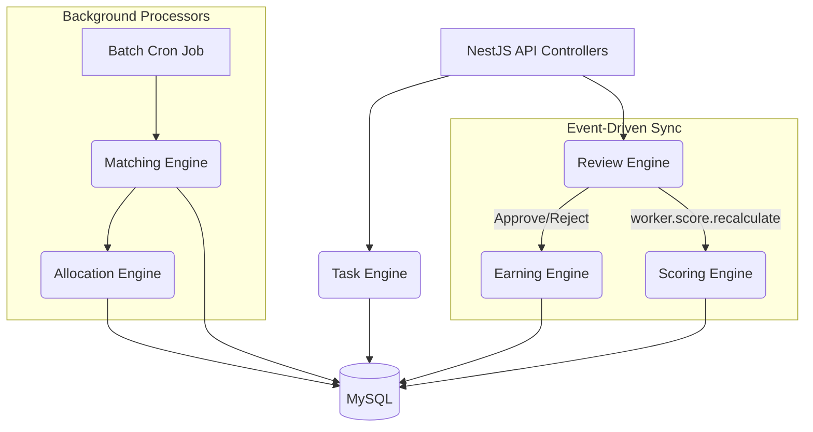

# Task Engine - System Architecture

This document describes the accurate, production-ready backend architecture of the Task Engine Platform.

## 🏗️ Core Architecture Overview

The system operates as a modular monolith. It leverages **NestJS** for the API layer and background cron jobs, and **TypeORM + MySQL** for the data layer. 

**Critical Design Principle**: We do **not** use Redis queues (like BullMQ) or separate microservice instances at this stage. Background processing (like Task Matching and Allocation) runs inside NestJS via scheduled Cron Jobs and batch processors. Cross-engine communication is primarily handled via NestJS `EventEmitter2` to maintain a robust, event-driven internal state.

## 🧠 Core Engines

### 1. Matching & Allocation Engine (The Brain)
**Purpose**: Automatically matches pending tasks to the best eligible workers.
- **Pure Score-Driven Model**: We do *not* filter by location or arbitrary tags. The only hard filter is:
  - **Active Filter**: Is the worker active?
- **Ranking**: Eligible workers are strictly sorted by their **Performance Score** (calculated by the Scoring Engine). Higher-rated workers get first dibs on tasks.
- **Allocation Retry Safety**: If a task fails to assign due to an internal error, the `BatchService` increments a `noMatchCount`. After 3 failed attempts, the task is marked as `FAILED` to prevent infinite CPU loops.

### 2. Review Engine & Earning Engine (Idempotent Flow)
**Purpose**: Handles the approval of submitted tasks and pays the worker.
- **Split-Brain Protection**: Approving a task and paying the worker happen synchronously in the `ReviewDecisionService`. If the payment fails (e.g. database disconnect), the submission is marked as `failed_payment`, preventing a "split-brain" where a task is approved but unpaid.
- **Idempotency**: `EarningEngine` uses `UNIQUE` constraints (`taskId`, `status`) to ensure double-payouts are impossible, even if retried.

### 3. Scoring Engine (Real-time Ranking)
**Purpose**: Maintains a live, accurate score for every worker to drive the Matching Engine.
- **Event-Driven Updates**: Unlike polling, the Scoring Engine listens to the `worker.score.recalculate` event emitted by the Review Engine. 
- The moment a task is approved or rejected, the worker's score is immediately recalculated and persisted, ensuring the Ranking Engine always uses up-to-the-millisecond performance data.

### 4. Task Engine
**Purpose**: Manages the core lifecycle of a task and interacts with the API controllers.
- Tasks transition through a strict State Machine (`PENDING` -> `ASSIGNED` -> `ACCEPTED` -> `IN_PROGRESS` -> `SUBMITTED` -> `APPROVED`).
- Workers submit task proofs via the `WorkerTaskController`, which delegates the state change to the Task Engine. *(Note: There is no isolated "Execution Engine" module; task execution state is handled directly by the Task Engine.)*

## 💾 Database Access Pattern
We use a **Shared Repository Pattern**. Engines do not communicate via HTTP APIs; they interact via direct TypeORM Repository calls and EventEmitters. This ensures ACID compliance across complex transactions (like task assignment and earning generation) using `pessimistic_write` row locks where necessary.

- **Workers Table**: Stores raw stats (`total_tasks_completed`, `total_tasks_rejected`).
- **Worker_Scores Table**: Stores the calculated ranking score.
- **Earnings Table**: Ledger of payouts.
- **Campaign_Worker_Participation Table**: Prevents a worker from doing the same campaign twice.

## 🚀 Scaling & Deployment
- The platform is deployed on a Linux VPS using **PM2** or **Docker**.
- Database is **MySQL 8.0+**.
- No external cache (Redis/Memcached) is strictly required for core operations, making deployment simple and resilient.
